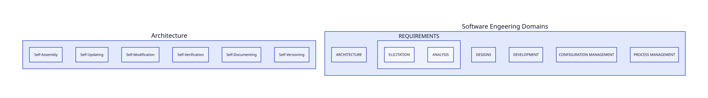
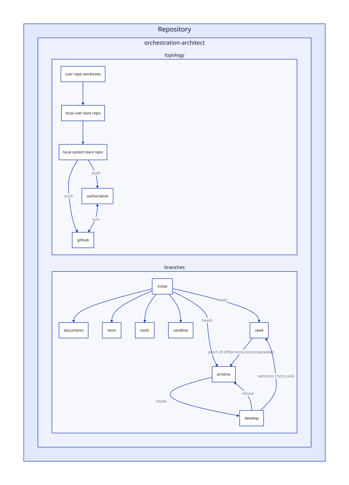
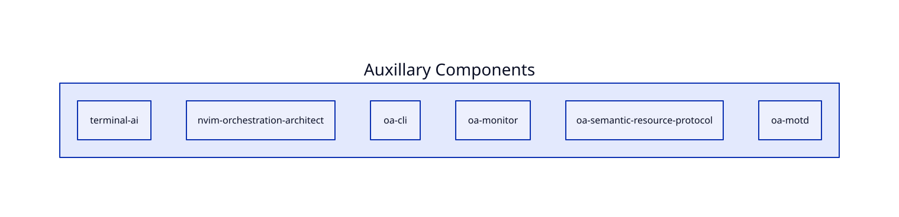

**L3**

---

# OA000: Recovery System
## Regenerate

Generates the system.

If existing, this process will regenerate broken parts.

Restores missing components of a system.      

## Recover

This system allows you to
unlock the Encrypted Master System and
access the data partitions and backups

Used to access encrypted backups, data and systems.        

## Restore

This system allows for migrations to new systems
and restoring from backups.        

# OA001: Encrypted Portable Master Control System

Encrypted persistent portable bootable system.

Generate systems from configurations.

Deploys systems over network or onto physical media.        

**Encrypted**: Encrypted boot media

**Transisent**: Provide a secure environments to deploy ephemeral systems.

**Self-contained**: Design to deploy orchestrate architecture deployments

**Offline**: Designed to support deploying in air gapped environments

**Secure**: Stores the master keys to allow deployed systems to be generated
with new keys. 

Each deployment can rotate keys.

# OA002: Live Ephemeral Immutable Nested Hypervisor

A system design to create a nested ephemeral PXE booted system that runs in memory.

Hardened system that creates OA001 Service worker account with rotated keys.

Configured PAM, SUDO, SSH to be restricted as possible.

Auto logins into an ephemeral guest account by default.

Requires no storage.

The OA001 embeds the secrets.

Used to allow systems to reboot without restarting system.      

# ALL THE ELSE 

