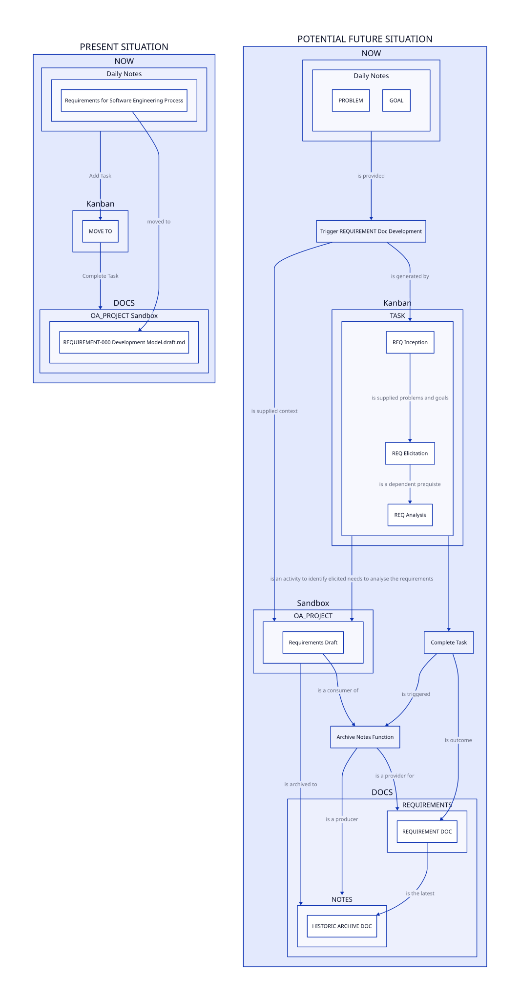

## Software Engineering PROCESS

### Requirements Elicitation

    AFTER MANAGING TO TAME THE COGNITIVE OVERLOAD, 
    THERE IS A LOT MORE WORK INVOLVED IN KEEPING EVERYTHING IN SYNC
    DISPITE IT BEING EASY. THE STRESS OF THE ARCHITECTURE WHERE 
    IT IS EXPECTED THINGS DECAY BUT ARE DESIGNED TO RE-EMERGE LIKE 
    A PHEONIX IN THE ASHES BUT BETTER IS LEADING TO FRUSTRATION
    WITH THE PROJECT. THERE IS A DESIRE TO MAKE IT CLEAR WHAT GOAL IS,
    TO MAKE SURE WHAT THE RIGHT THING IS AND HOW IT FITS INTO A 
    BIGGER PICTURE.

    THERE IS A FEAR THAT BEATING THE COGNITIVE OVERLOAD PROCESS MAY BE 
    LOST AND THERE IS A NEED FOR A NATURAL PROCESS TO ENSURE THAT 
    IT IS WELL UNDERSTOOD WHY. WE WANT TO ENSURE 
    THAT ANY DEVELOPMENT PROCESS a) COHERES WITH THE SWEBOK (BECAUSE IT 
    MAKES SENSE THAT PROFESSIONAL SOFTWARE ENGINEERS KNOW ABOUT 
    SOFTWARE ENGINEERING),
    and B) CAN PROVE ITSELF (THAT IT IMMEDIATELY ASSISTS).

> **SEEMS TO BE ELICITATION IS THE 'TALK TO THE RUBBER DUCK'**

> **THIS IS SIMILAR TO HOW RETROSPECTIVES AID THE PROCESS**

> **BASIC MANAGEMENT THEORY THAT OBSERVATIONS CHANGE BEHAVIOUR**

> **THE DUCK IS WATCHING**

AIM (POTENTIAL DOCS):

Automate (at least congitively) a set of processes and protocols.
Reduce project housekeeping, to free up more time.
Develop an overview of the architecture.
Develop a composable resource that were used to achieve an aim that can be reused for other problems.

PROBLEMS (CURRENT STATE):
    
Many things that have been half done or already that,
and it is a chore and distracts from remember the reason things 
are being done. Even though the information is there.

Sometimes steps are skipped only to cause problems later. 
There needs to be a way to make the process fluid and natural.

The constant context switching is being addressed by just being 
better (the idea is to make a lot of the tasks instictive). 

But the frustration with needing to look things up what needs to 
go in what document and having to look for the inputs into the 
different stages of the process 

Also a bunch of NOTES that hold imported resources, was widely
impractical, so splitting where the notes go was used to solve a 
previous problem. Now the challenge is to make the resources, 
go where it makes sense logically.

Another problem is that nothing is making it through the pipeline, 
though convergence is taking its time, and due to being a team 
of size *UNO* that means there is a real need to switch up what is 
being worked on, however, there are some basically good working
prototypes, but it cannot be added till it is fully realised, 
otherwise it will get lost (DATABASES ARE NOT ALLOWED DUE TO ARCHITECTURAL
DECISIONS RESTRICTING WHAT CAN GO INTO THE CORE OF THE PROJECT).

IDENTIFIED RESOURCES/POSSIBLE SOLUTIONS: 

- THE ARCHITECTURE THAT MODELS THE PROCESSES AND RELATIONS SHOULD BE IDENTIFIED 
  SUCCICTLY (DIAGRAM OF OBJECTS AND MORPHISMS) 
- THE INFORMATION NEEDS TO BE READILY ACCESSIBLE.
- EACH PROCESS SHOULD BE SUCCINCT AND CONTAIN THE RELEVANT INFORMATION 
  FOR THE TASKS (i.e. templates and resources).
- SWEBOK AREAS OF KNOWLEDGE ARE USED 
  TO ORGANISE A MORE COHERENT MODEL FOR NOTES.
- PROJECT MANAGEMENT PROCESS/SYSTEM AND  SOFTWARE ENGINEERING PROCESS/SYSTEM SHOULD 
  NATURALLY COHERE.

## Requirements Analysis

**ANALYSIS**

ANALYSIS OF FUNCTIONAL REQUIREMENTS:

    F(X) <= F(Y) WHERE F IS THE PROCESS, AND X IS THE CURRENT STATE, Y IS THE DOCS STATE 
    SUCH THAT W(X) <= W(Y) WHERE W IS PRODUCTIVE WORK THAT GETS DONE. A PROFESSIONAL FUNCTOR,
    A PRO-FUNCTOR IF YOU WILL. X IS THE PRODUCT OF THE PROJECT PREORDER AND THE WORK THAT GETS 
    DONE IS IDEALLY A PRE-ORDER. THAT MEANS THAT WORK MUST BE DONE IN A WAY THAT EVEN IF IT GOES BACKWWADS
    THAT THE WORK IS STILL HEADING IN THE RIGHT DIRECTION. MIGHT EVEN BE THE PROPER WAY TO GO.

    SIMPLY THE PROCESS SHOULD NOT MAKE THINGS MORE DIFFICULT.

> **FUNCTIONAL REQUIREMENT** AS THE SOLE TEAM MEMBER I NEED TO SEE THE PROCESS AS A PICTURE SO THAT 
    I CAN SEE HOW I AM TRACKING.

> **FUNCTIONAL REQUIREMENT** AS THE SOLE TEAM MEMBER I MUST BE ABLE TO BEGIN A PROCESS SUCH THAT 
    THE PARTICULAR DOCUMENT THAT HAS THE REQUIREMENTS IN A TEMPLATE.

> **FUNCTIONAL REQUIREMENT** AS THE SOLE TEAM MEMBER I MUST KNOW THAT THESE DOCUMENTS ALIGN 
    WERE DESIGNED TO ACHIEVE THE SAME OUTCOMES AS EACH STEP IN THE SWEBOK.
    
    **TASK** WRITE A DESIGN DOCUMENT THAT HAS THE STRUCTURE AND EXPLAINATION/EXAMPLES.

ANALYSIS OF *EMERGENT REQUIREMENTS*:
    SOLUTIONS NEED TO BE SELF-EVIDENT. 
    NEED TO KNOW WHERE THINGS ARE EASILY (THERE IS A NATURAL CORRESPONDENCE BETWEEN RELATED TASKS AND FOCUS).
    NEED TO KNOW WHERE TO SEE THE BIG PICTURE (IDENTIFY THE REALISED PATHWAYS).
    NEED TO ENSURE EACH THING CONTAINS ENOUGH INFORMATION TO DO WITHIN ITSELF.
    NEED TO GET THINGS DONE AND IN A KNOWN STATE.
    DOCS CHANGES ONLY INVOLVE DISTILLATION OF THE STEPS.
    EVERYTHING SHOULD BE A PREORDER, EVERYTHING HAS AN INITIAL POINT, AN INCEPTION.
    THE STRUCTURE OF THE WORK SHOULD 
    


ANALYIS OF *NON FUNCTIONAL REQUIREMENTS*:
    RETRIEVABILITY: RESOURCES ARE EASILY ACCESSED 
    OBSERVABILITY: CAN SEE THE THINGS GET DONE. 
    TRACABILITY: WHERE THINGS COME FROM ARE IDENTIFIED.
    USABILITY: WORK FLOW IS BETTER THAN IT WAS.
    UTILITY: 
    

    
ASSUME NOT NEEDING TO REVISE THE DOCUMENT ADDED. BUT THE FIRST REQ. IS INITIAL POINT.

THIS IS HOW WE WILL USE EMERGENCE TO SOLVE THE PROBLEM, AN INITIAL SELF-SPECIFYING INITIAL OBJECT.

THIS IS THE DESIGN DOC PART.

*WHAT WE HAVE -> WHAT WE DO -> WHAT WE WANT TO DO -> WHAT WE WILL HAVE*

WHAT WE HAVE:
A NEW STRUCTURE FOR THE DOCUMENTS.
ARE EXISTING DISTILLATION OF SWEBOK REQUIREMENTS KNOWLEDGE AREA NOTES AND A DIAGRAM TO EXPLAIN IT.
PROBABLY NOTES ON MINSKYS RESOURCEFULNESS AND OBJECTIVES STUFF. A USEFUL REFERENCE BUT NONETHELESS.
DESIGN DOCUMENT PROTOTYPES AND A DRAFT DESIGN DOCUMENTS, AND AI SUGGESTION ON WHAT NEEDS TO BE IN THERE.


THIS IS TWO SETS OF DIAGRAMS. 

AND HOW WE WILL GET THERE.



```d2
PRESENT SITUATION: {
    NOW -> Kanban.TASK: Add Task 
    Kanban.TASK -> DOCS: Complete Task 

    Kanban: {  
    TASK: MOVE TO
    }

    NOW: {
        Daily Notes.Requirements for Software Engineering Process 
    } 
    DOCS: {
        OA_PROJECT Sandbox."REQUIREMENT-000 Development Model.draft.md"
    }

    NOW.Daily Notes.Requirements for Software Engineering Process -> DOCS.OA_PROJECT Sandbox."REQUIREMENT-000 Development Model.draft.md": moved to
}

POTENTIAL FUTURE SITUATION: {    
    NOW.Daily Notes: {grid-columns: 2;PROBLEM; GOAL;
    #PROBLEM -> NEED <- GOAL
    }
    NOW.Daily Notes -> Trigger REQUIREMENT Doc Development: is provided
    # NOW.Daily Notes.PROBLEM -> Trigger REQUIREMENT Doc Development: is provided
    #NOW.Daily Notes -> Sandbox.OA_PROJECT: trigger Inception Command
    Trigger REQUIREMENT Doc Development -> Sandbox.OA_PROJECT: is supplied context
    # Frees up sandbox clutter and provides a location within the docs 
    # namespace for linking historic documents 
    Sandbox.OA_PROJECT -> DOCS.NOTES: is archived to
    Archive Notes Function -> DOCS.NOTES: is a producer
    Complete Task -> Archive Notes Function: is triggered
    Sandbox.OA_PROJECT.Requirements Draft -> Archive Notes Function: is a consumer of
    Archive Notes Function -> DOCS.REQUIREMENTS: is a provider for
    DOCS.REQUIREMENTS.REQUIREMENT DOC -> DOCS.NOTES.HISTORIC ARCHIVE DOC: is the latest 
    Kanban.TASK -> Sandbox.OA_PROJECT: is an activity to identify elicited needs to analyse the requirements

    
    #Sandbox.OA_PROJECT.Requirements -> OA_NOTE.Requirements.V1: is archived
    #Sandbox.OA_PROJECT.Requirements Draft -> Sandbox.OA_PROJECT.Requirements Draft: is symlink target
    Trigger REQUIREMENT Doc Development -> Kanban.TASK: is generated by
    
    
    #NOW.Daily Notes.PROBLEM -> Kanban.TASK.REQ Elicitation: ADD ELICITATION SUBTASK
    #NOW.Daily Notes.PROBLEM -> Kanban.TASK.REQ Analysis: ADD ANALYSIS SUBTASK 
    Kanban.TASK: {label: TASK}
    Kanban.TASK.Start: {label: REQ Inception} 
    Kanban.TASK.Start -> Kanban.TASK.REQ Elicitation: is supplied problems and goals 
    Kanban.TASK -> Complete Task
    Kanban.TASK.REQ Elicitation -> Kanban.TASK.REQ Analysis: is a dependent prequiste
    # Kanban.TASK.REQ Elicitation -> Sandbox.OA_PROJECT.Requirements Draft: is added to 
    # Kanban.TASK.REQ Analysis -> Sandbox.OA_PROJECT.Requirements Draft: is added to
    Complete Task -> DOCS.REQUIREMENTS.REQUIREMENT DOC: is outcome 
    #   Trigger REQUIREMENT Doc Development -> DOCS.REQUIREMENTS.REQUIREMENT DOC DRAFT SYMLINK: is created by
    #   DOCS.NOTES.Requirements Draft -> DOCS.REQUIREMENTS.REQUIREMENT DOC DRAFT SYMLINK: is a resource
    #   Complete Task -> DOCS.REQUIREMENTS.REQUIREMENT DOC DRAFT SYMLINK: removes

 
    

    #DOCS.REQUIREMENTS.REQUIREMENT DOC
    # NOW.Daily Notes.PROBLEM -> Sandbox.OA_PROJECT.Requirements Draft: Start Requirements Process 

}
```


