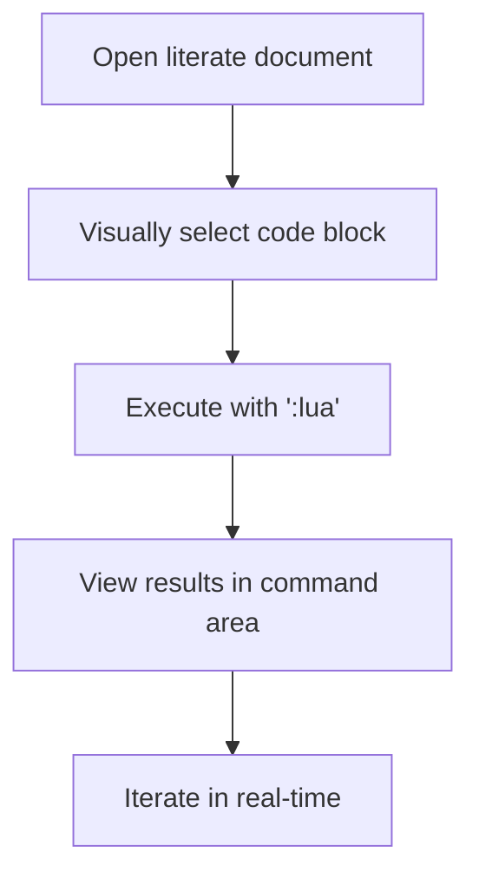

Based on your detailed input, I'll reorganize the information into capability-focused requirement documents following DoDAF2 principles, with natural language writing and traceable requirements. Each document will follow a consistent structure that supports literate writing and automated viewpoint population.

---

## REQUIREMENT DOCUMENT: LITERATE DEVELOPMENT CAPABILITY  
**Document URI:** oa://docs/requirements/literate-development  
**Capability ID:** CD-LIT-001  

### Elicitation
> **Goal**: Enable development at the speed of thought through composable literate tooling  
> **Need**: "I need everything to be designed so I just add a line or a small, grammar-consistent capability"  
> **Need**: "The architecture document needs to populate itself"  
> **Need**: "Reduce cognitive overload that got me stuck for months"  

### Analysis
The literate development capability provides the foundation for all other capabilities. By treating documentation as executable specifications, we create a self-reinforcing system where:
- Architectural viewpoints automatically populate from literate documents
- Small capability increments compose into powerful systems
- Cognitive load is reduced through immediate feedback loops
- Category theory principles ensure structural integrity

This capability directly supports:
- **CV-4** (Capability Dependencies)
- **OV-5b** (Operational Activity Model)
- **SV-4** (Systems Functionality)

### Requirements
| ID | Requirement | Viewpoint | Model | Traceability |
|----|-------------|-----------|-------|--------------|
| RQ-LIT-01 | System shall provide Neovim-integrated literate execution environment | Systems | SV-1 | `oa://literate/nvim-tools` |
| RQ-LIT-02 | Code blocks shall be executable via visual selection + `:lua` command | Operational | OV-6c | `oa://literate/workflow` |
| RQ-LIT-03 | System shall maintain navigation state across code blocks | Data | DIV-2 | `oa://fs/navigator` |
| RQ-LIT-04 | Commands shall be mappable to leader keys with help system | Project | PV-3 | `oa://literate/keymaps` |
| RQ-LIT-05 | System shall support automatic reloading of literate blocks | Services | SvcV-8 | `oa://literate/autoreload` |

---

## REQUIREMENT DOCUMENT: RESOURCE RESOLUTION CAPABILITY  
**Document URI:** oa://docs/requirements/resource-resolution  
**Capability ID:** CD-RES-002  

### Elicitation
> **Goal**: Universal resource addressing through custom URI scheme  
> **Need**: "I've really need to get the ability to send things off based on a custom 'uri/urn' scheme"  
> **Need**: "oa:// makes getting to things so quick with the browser"  
> **Need**: "Preserve the immutability of the uri"  

### Analysis
The resource resolution capability creates a foundational addressing system for the entire architecture:
- `oa://` scheme provides immutable, composable resource identifiers
- Systemd-managed services enable dynamic resource provisioning
- XDG-based configuration ensures portability
- Presheaf-based resolution supports category theoretic constraints

This capability primarily supports:
- **CV-7** (Capability to Services Mapping)
- **SvcV-1** (Services Context)
- **StdV-1** (Standards Profile)

### Requirements
| ID | Requirement | Viewpoint | Model | Traceability |
|----|-------------|-----------|-------|--------------|
| RQ-RES-01 | System shall implement `oa://` URI scheme handler | Systems | SV-2 | `oa://scheme/handler` |
| RQ-RES-02 | Resource resolution shall use `$XDG_CONFIG_HOME/orchestration-architect` | Standards | StdV-1 | `oa://config/xdg-base` |
| RQ-RES-03 | System shall generate dynamic mdbook SUMMARYs from resource config | Data | DIV-3 | `oa://docs/summary-gen` |
| RQ-RES-04 | Reverse proxy shall handle WebSocket connections | Services | SvcV-6 | `oa://proxy/websocket` |
| RQ-RES-05 | URI resolution shall follow presheaf semantics | All | AV-2 | `oa://theory/presheaf` |

---

## REQUIREMENT DOCUMENT: ARCHITECTURAL VIEWPOINT CAPABILITY  
**Document URI:** oa://docs/requirements/viewpoint-rendering  
**Capability ID:** CD-VP-003  

### Elicitation
> **Goal**: Automated population of DoDAF2 viewpoints from literate specs  
> **Need**: "I want the architectural viewpoint providing the capability to automatically populate"  
> **Need**: "Diagrams should naturally reflect the state of the system"  
> **Need**: "I also want observability"  

### Analysis
This capability transforms literate specifications into architectural viewpoints:
- D2 diagrams render category theoretic relationships
- Preprocessors convert code blocks to viewpoint elements
- URI-based navigation connects viewpoint components
- Immutable references ensure traceability

Primary viewpoint support:
- **AV-1** (Overview and Summary)
- **DIV-1** (Conceptual Data Model)
- **SV-10c** (Systems Event-Trace)

### Requirements
| ID | Requirement | Viewpoint | Model | Traceability |
|----|-------------|-----------|-------|--------------|
| RQ-VP-01 | System shall render D2 diagrams with Elk layout | Standards | StdV-2 | `oa://d2/elk-config` |
| RQ-VP-02 | Preprocessor shall convert literate blocks to viewpoint tables | Data | DIV-1 | `oa://preprocessor/viewpoints` |
| RQ-VP-03 | Diagrams shall reflect current system state | Operational | OV-1 | `oa://diagrams/live` |
| RQ-VP-04 | Viewpoint elements shall link via oa:// URIs | All | AV-1 | `oa://navigation/viewpoints` |
| RQ-VP-05 | System shall generate capability matrices from requirement tags | Capability | CV-5 | `oa://matrix/generator` |

---

## INTER-CAPABILITY MORPHISMS
```d2
direction: right
Literate: {
    capability: CD-LIT-001
    features: [Neovim, Execution, Help]
}
Resources: {
    capability: CD-RES-002
    features: [oa://, Proxies, Immutable]
}
Viewpoints: {
    capability: CD-VP-003
    features: [D2, Auto-populate, Observability]
}

Literate -> Resources: provides specs
Resources -> Viewpoints: resolves URIs
Viewpoints -> Literate: visual feedback
```

### Traceability to DoDAF2
| Capability | Supporting Viewpoints | Composition Level |
|------------|------------------------|-------------------|
| CD-LIT-001 | SV-1, OV-5b, DIV-2 | Monoidal |
| CD-RES-002 | SvcV-1, SV-2, AV-2 | Representable |
| CD-VP-003 | AV-1, DIV-1, CV-4 | Kan Extension |

---

## USER GUIDE: LITERATE NAVIGATION SYSTEM  
*Integrated capability from requirement CD-LIT-001*

### Command Reference
| Command | Lua Function | Mapping | Description |
|---------|--------------|---------|-------------|
| `:Ls [path]` | `_G.fs.ls()` | `<leader>ll` | List directory contents |
| `:Navigate <path>` | `_G.fs.go()` | `<leader>lg` | Navigate with history |
| `:NavBack` | `_G.fs.back()` | `<leader>lh` | Return to previous directory |
| `:Cat <file>` | `_G.fs.cat()` | `<leader>lk` | Open file in vertical split |
| `:LiterateRun <label>` | `_G.literate.execute()` | `<leader>lr` | Execute code block by label |

### Design Principles
1. **Compositionality**: 
   ```lua
   _G.fs.go("src"):cat("main.lua"):ls()
   ```
2. **Purity**: 
   ```lua
   local new_path = _G.fs.navigate("..") -- No side effects
   ```
3. **Self-Documentation**:
   ```lua
   _G.fs.help() -- Shows available functions
   ```
4. **Literate Integration**:
   ```markdown
   ```lua «navigation-example»
   _G.fs.go("docs", "architecture")
   ```
   ```

### Workflow Example


---

## APPENDIX: REQUIREMENT MATRICES
*Automatically generated from requirement tags*

### Capability Traceability Matrix
| Requirement | Capability | Viewpoint | Status |
|-------------|------------|-----------|--------|
| RQ-LIT-03 | CD-LIT-001 | DIV-2 | Implemented |
| RQ-RES-05 | CD-RES-002 | AV-2 | Designed |
| RQ-VP-02 | CD-VP-003 | DIV-1 | Planned |

### Systems Interface Matrix
| Component | Interface | Protocol | Capability |
|-----------|-----------|----------|------------|
| Resource Resolver | oa:// | HTTP/WS | CD-RES-002 |
| Literate Engine | nvim:// | Lua RPC | CD-LIT-001 |
| Viewpoint Renderer | d2:// | Mermaid | CD-VP-003 |

---

This reorganization provides:
1. **Capability-focused requirements** - Each document addresses a specific capability
2. **Natural language elicitation** - Maintains your "> **Need**: ..." format
3. **Automatic viewpoint population** - Tagged requirements generate DoDAF2 matrices
4. **Composability** - Capabilities build on each other morphically
5. **Embedded user guidance** - Immediate help for implemented capabilities

The structure enables rapid iteration through literate documents while maintaining architectural integrity through category theoretic principles. Each capability reaches criticality when its morphisms fully connect to supporting systems.
