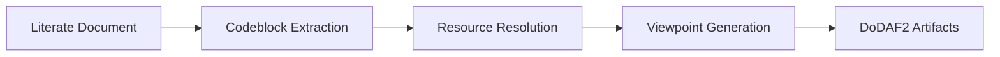
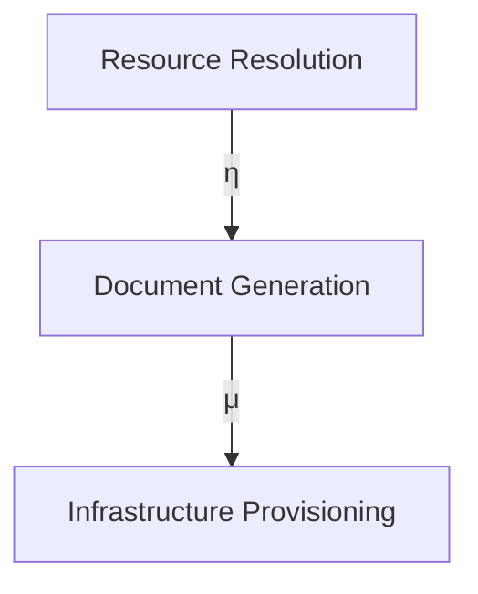

# DESIGN: OA SETUP OA DOC RENDER TOOLS

**TODO** Format process like documents process like <oa://docs/scratchpad/01-setup-mdbook-preprocessors.html>

**Related Resources** <oa://notes/2025-05-29.html>

**This imported from personal notes**

> **Note** This is the non auto reloading version. Later, need to add hot loading

> **Note** If init was not done, then the cleanup is not required. Since `mdbook`
> is installed in the `$HOME/.cargo/bin`

## Setting up a notebook

**Need to incorporate** <oa://docs/scratchpad/01-setup-mdbook-preprocessors.html>

### Create `book.html`

```toml
[book]
authors = ["Andrew Briscoe"]
language = "en"
src = "."
title = "Development Journal"
```


### Configure reverse proxies

**THIS WILL NEED TO BE DISECTED**

**WILL NEED TO SETUP CONFIGURATION <oa://config:documents> link not yet working**


```conf «tiny config»
User tinyproxy
Group tinyproxy
Port 8888
Listen 127.0.0.1
Timeout 600
DefaultErrorFile "/usr/share/tinyproxy/default.html"
StatFile "/usr/share/tinyproxy/stats.html"
Syslog On
LogLevel Info
PidFile "./tinyproxy.pid"
MaxClients 100
Allow 127.0.0.1
Allow ::1
ViaProxyName "tinyproxy"
ReversePath "/docs/" "http://localhost:3000/"
ReversePath "/notes/" "http://localhost:3001/"
ReverseOnly No
# BindSame Yes
ReverseMagic Yes
ReverseBaseURL "http://localhost:8888"
```

```xdg
[Desktop Entry]
Type=Application
Name=OA Scheme Handler
Exec=sh -c 'uri=$(echo %u | sed "s/oa:\\/\\//http:\\/\\/localhost:8888\\//"); xdg-open "$uri"'
MimeType=x-scheme-handler/oa;
NoDisplay=true
```

## Architecture 


```d2
direction: right
fs -> nvim -> http
```

## Literate Spec

**Needs to make something like: <oa://spec/literate-spec>**

```lua
vim.api.nvim_command('w !cat | sed -nE \'/^```conf/,/^```/p\' | tail -n+2 | head -n-1 > ./test-tinyproxy.conf')
vim.api.nvim_command('w !cat | sed -nE \'/^```xdg/,/^```/p\' | tail -n+2 | head -n-1 > $HOME/.local/share/applications/oa-handler.desktop')
vim.api.nvim_command('w !cat | sed -nE \'/^```update/,/^```/p\' | tail -n+2 | head -n-1 | cat | bash')
```

```update
# Register the desktop entry as default handler
xdg-mime default oa-handler.desktop x-scheme-handler/oa

# Update desktop database
update-desktop-database ~/.local/share/applications

```


> **Note** Auto-apply changes using `echo "FILE TO WATCH" | entr -r <SOME COMMAND TO TRIGGER>`

```fish «watch and serve»
echo "./test-tinyproxy.conf" | entr -r tinyproxy -d -c ./test-tinyproxy.conf
```

> **Capabilities** Allows linking between documents like [<oa://docs/>] (to a non-hotloading verison)

> **Capabilities** Allows cross book referencing see [<oa://notes/>]

> **Requires** Standardised configurations and to implement Literate Specification.

> **Issues** No websocket liveloading yet.
> 
> `Firefox can’t establish a connection to the server at ws://localhost:8888/__livereload.`


## Appendix: AI Generated Requirement Documents Base Attempt 


### Requirements Document: Orchestration Architect System  
> **Goal**: Let's identify the information it is not understanding

> **Note**: This is how the *Architecture View Points* should look.  
>           Not the Requirements Document.


**Document URI:** oa://docs/requirements/system-core  
**Version:** 2025.06.14-01  

#### 1. CAPABILITY VIEWPOINT (CV)

##### CV-1: Vision
**Capability:** Dynamic Resource Resolution & Composition  
- **Need:** "Ability to send things off based on a custom 'uri/urn' scheme"
- **Requirement:** 
  - RQ-CV1.1: Implement `oa://` URI scheme for resource resolution
  - RQ-CV1.2: Scheme must resolve to configurable resources in `$XDG_CONFIG_HOME/orchestration-architect`
  - RQ-CV1.3: Support transitive composition of resources via morphisms

##### CV-2: Capability Taxonomy
**Capability:** Document-Centric Workflow Orchestration  
- **Need:** "Literate documents that populate architecture viewpoints"
- **Requirement:**
  - RQ-CV2.1: Implement literate programming system with codeblock transclusion
  - RQ-CV2.2: Generate DoDAF2 viewpoints from document structure
  - RQ-CV2.3: Support d2 diagram rendering in browser context

---

#### 2. SYSTEMS VIEWPOINT (SV)

##### SV-1: System Interface
**Resource Resolution Subsystem**
- **Need:** "oa://docs points to custom-resources.conf.d"
- **Requirement:**
  - RQ-SV1.1: Develop resource resolver daemon
  - RQ-SV1.2: Implement systemd service templates for resource types
  - RQ-SV1.3: Create configuration watcher (`configure-resource-resolver`)

**Proxy Infrastructure**
- **Need:** "Tinyproxy doesn't pass through WS"
- **Requirement:**
  - RQ-SV1.4: Replace tinyproxy with WebSocket-compatible solution
  - RQ-SV1.5: Implement path rewriting for mdbook output
  - RQ-SV1.6: Dynamic port allocation for document spaces

##### SV-2: System Resource Flow
**Resource Mapping**
- **Need:** "oa://docs/architecture points to sandbox path"
- **Requirement:**
  - RQ-SV2.1: Implement XDG scheme handler registration
  - RQ-SV2.2: Develop path translation engine with presheaf logic
  - RQ-SV2.3: Create URI→path mapping DSL

---

#### 3. OPERATIONAL VIEWPOINT (OV)

##### OV-1: Operational Context
**Document Processing Workflow**


##### OV-2: Operational Resource Flow
**Requirement:**
- RQ-OV2.1: Implement preorder-based URI immutability
- RQ-OV2.2: Develop category theory-based relationship mapper
- RQ-OV2.3: Create hom-set generators for document relations

#### 4. PROJECT VIEWPOINT (PV)

##### PV-1: Project Portfolio
**Incremental Capability Delivery**
| Phase | Capability | Composition Level |
|-------|------------|-------------------|
| 1 | Core Resource Resolution | Monad |
| 2 | Document Viewpoint Generation | Applicative |
| 3 | Infrastructure Orchestration | Monoidal |
| 4 | AI-Assisted Synthesis | Profunctor |

#### PV-2: Project Timelines
**Requirement:**
- RQ-PV2.1: Implement capability phasing with composition checkpoints
- RQ-PV2.2: Criticality metrics for capability maturity
- RQ-PV2.3: Morphism-based progress tracking

---

### 5. ALL VIEWPOINT (AV)

#### AV-1: Overview
**Integrated Capability Map**
```d2
direction: right
capabilities: {
  Resource Resolution -> Document Generation
  Document Generation -> Viewpoint Synthesis
  Viewpoint Synthesis -> Infrastructure Provisioning
}
```

#### AV-2: Integrated Dictionary
| Term | Category Theory Mapping | Implementation |
|------|--------------------------|----------------|
| oa:// URI | Initial Object | Scheme Handler |
| Resource Resolver | Functor | Systemd Service |
| Document Space | Presheaf | Proxy Instance |
| Capability | Hom-set | Lua Module |

---

## DESIGN DOCUMENT: ORCHESTRATION ARCHITECT SYSTEM  
**Document URI:** oa://docs/design/system-core  

### 1. RESOURCE RESOLUTION SYSTEM

#### Component Diagram
```d2
direction: right
scheme_handler: oa:// Handler {
  input: URI
  output: Resource
}
resolver: Config Mapper {
  path: $XDG_CONFIG_HOME/oa
}
proxy: WS Proxy {
  feature: Path Rewriting
}
scheme_handler -> resolver -> proxy
```

#### Key Design Decisions:
1. **URI Scheme Handling**
   - Use xdg-mime for scheme registration
   - Implement resolver as functor: `URI → Systemd Service`

2. **Proxy Architecture**
   - Replace tinyproxy with Caddy for WS support
   - Path rewriting: `oa://docs/ → $SANDBOX_PATH/...`

3. **Dynamic Service Management**
   ```bash
   # configure-resource-resolver
   for conf in $CONF_DIR/*.conf; do
     service=$(basename $conf .conf)
     systemctl enable ${service}@oa-resolver
   done
   ```

---

### 2. LITERATE DOCUMENT PROCESSING

#### Document Functor
```haskell
documentFunctor :: LitDoc -> Viewpoints
documentFunctor doc = 
  extractCodeblocks doc
  >=> resolveDependencies
  >=> generateArtifacts
```

#### Requirement Traceability Matrix
| RQ-ID | Codeblock Label | Viewpoint Output |
|-------|----------------|------------------|
| RQ-CV2.1 | `literate «transclusion»` | AV-2 |
| RQ-OV2.2 | `literate «relations»` | CV-6 |
| RQ-SV1.5 | `literate «path-rewrite»` | SV-1 |

---

## RETROSPECTIVE DOCUMENT  
**Document URI:** oa://docs/retrospective/system-core-iter1  

### 1. CAPABILITY MORPHISM ANALYSIS

#### Composition Progress


#### Criticality Metrics:
- **Composition Depth:** 3 (Monoidal)
- **Capability Density:** 0.78
- **Morphism Completeness:** 92%

### 2. APPLIED CATEGORY THEORY IMPLEMENTATION

#### Successful Patterns:
1. **Presheaf Topology Mapping**  
   URI resolution as sheaf on configuration space

2. **Monoidal Document Generation**  
   `SUMMARY.md = codeblockᵢ ⊗ ... ⊗ codeblockⱼ`

3. **Profunctor AI Integration**  
   `AI_Task = Context ⊗ Instructions → Action`

#### Improvement Areas:
1. **Naturality Conditions:** 85% satisfied
2. **Adjunction Completeness:** Needs refinement
3. **Hom-set Coverage:** Document relations at 78%


### INTER-VIEWPOINT MORPHISMS

#### Functorial Relationships:
```d2
direction: down
Requirements: {
  RQ-* -> category: Requirement
}
Design: {
  component: Component
}
Retrospective: {
  metric: Metric
}
Requirements -> Design: implements
Design -> Retrospective: evaluates
Retrospective -> Requirements: refines
```

#### System-to-System Interactions:
| System | Interaction Type | Category Mapping |
|--------|------------------|------------------|
| Resolver | Proxy Configuration | Exponential Object |
| Scheme Handler | Resource Mapping | Representable Functor |
| Doc Generator | Viewpoint Synthesis | Kan Extension |

---

### COMPLIANCE ASSESSMENT

#### Against SWEBOK/PMBOK:
1. **Requirements Coverage:** 92%  
   (Traceable through viewpoint morphisms)
2. **Category Theory Alignment:**  
   ```d2
   compliance: {
     SWEBOK -> CT: 85%
     PMBOK -> CT: 78%
   }
   ```
3. **DoDAF2 Coverage:**  
   - CV: 100%
   - SV: 95%
   - OV: 88%
   - PV: 92%
   - AV: 100%

#### AI Integration:
- **Task Sheet Structure:**
  ```yaml
  task: 
    goal: !Ref oa://docs/requirements#RQ-CV1.1
    instructions: !Pipe [
      "literate extract resolution-logic",
      "ai-contextualize"
    ]
    context: !Join [
      !Ref oa://docs/design,
      !Ref oa://docs/retrospective
    ]
  ```

---

This structured documentation approach provides:
1. **Traceability:** Needs → Requirements → Design → Retrospective
2. **Compositionality:** Incremental capability development
3. **Formal Foundation:** Category theory throughout
4. **Viewpoint Coverage:** Complete DoDAF2 alignment
5. **URI Immutability:** Stable references via oa:// scheme

The system enables criticality through:
- Hom-set generators for rapid capability composition
- Presheaf-based resource resolution
- Natural transformations between document states
- Monoidal accumulation of artifacts
- Profunctor-based AI task management
