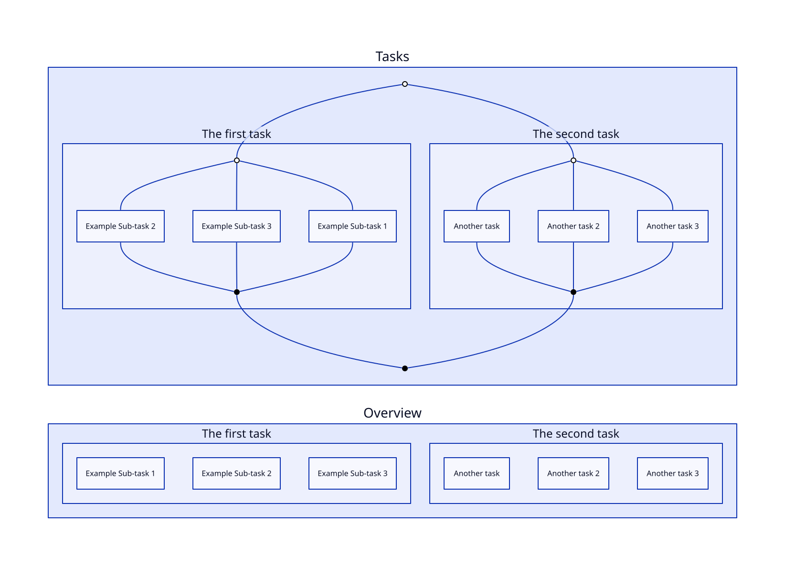
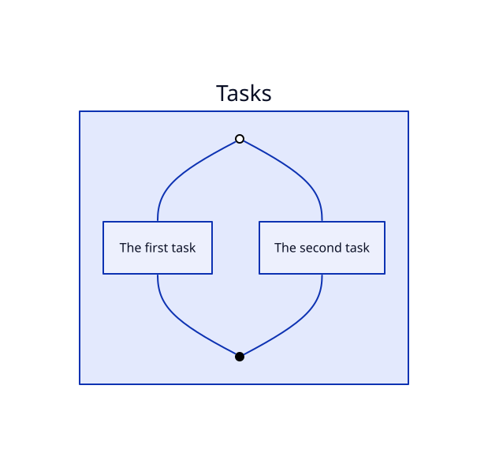

# Prototype Tasks Diagram

## Build Script

Script used to build diagrams

```sh
# file: build.sh
diagram_source="$1.d2"
diagram_output="$1.svg"

if [[ -f "$diagram_source" ]]; then
  echo "Converting $diagram_source to $diagram_output"
  d2 --watch=true "$diagram_source" "$diagram_output" --browser=1
else
  echo "not found: $diagram_source"
fi
```

## Diagrams

### Layout

Built using `tree | grep task`.

```
├── task1.d2 # The first task
├── task2.d2 # The second task
├── tasks.d2 # Diagram for tasks
└── tasks.svg # Output
```

### Contents

#### File `tasks.d2`

Built using `cat tasks.d2`

```d2
grid-columns: 1
classes._in: {
  shape: circle
  label: ""
  width: 10
  style.stroke: black
  style.fill: white
}
classes._out: {
  shape: circle
  label: ""
  width: 10
  style.stroke: black
  style.fill: black
}

Tasks: {
  Task 1: @task1.d2
  Task 2: @task2.d2
}

Overview: {
  label: "Overview"
  Task 1: @task1.d2
  Task 2: @task2.d2
}

Tasks: {
  _in.class:_in;
  _out.class:_out;
  T*: {_in.class: _in; _out.class: _out; _in -- T* -- _out}
  _in -- T*._in
  T*._out -- _out
}
```

#### File `task1.d2`

Built using `cat task1.d2`

```d2
label: "The first task"
Task 1: "Example Sub-task 1"
Task 2: "Example Sub-task 2"
Task 3: "Example Sub-task 3"
```

#### File `task2.d2`

Built using `cat task2.d2`

```d2
label: "The second task"
Task 1: "Another task"
Task 2: "Another task 2"
Task 3: "Another task 3"
```

#### File `tasks.svg`

Image generated using `d2 tasks.d2 tasks.svg`




### Collapsed Diagram Prototype

```
grid-columns: 1
classes._in: {
  shape: circle
  label: ""
  width: 10
  style.stroke: black
  style.fill: white
}
classes._out: {
  shape: circle
  label: ""
  width: 10
  style.stroke: black
  style.fill: black
}


Tasks.Task 1: @task1.d2.label
Tasks.Task 2: @task2.d2.label

Tasks: {
  _in.class:_in;
  _out.class:_out;
  _in -- T*
  T* -- _out
}

# --------
# Expanded
# --------
# - Adds the _in and _out class for every child `T*: {_in.class: _in; _out.class: _out; _in -- T* -- _out}`
# - Connect inner diagrams
#   - `_in -- T*_in` instead of `_in -- T*` 
#   - `T*._out -- _out` instead of `T* -- _out`
#
# Tasks: {
#   _in.class:_in;
#   _out.class:_out;
#   T*: {_in.class: _in; _out.class: _out; _in -- T* -- _out}
#   _in -- T*._in
#   T*._out -- _out
# }
```


