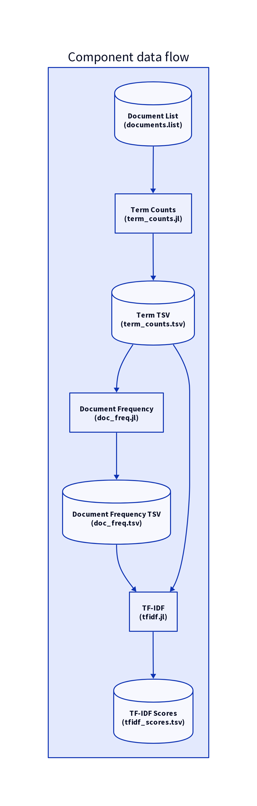

# Corpus-Level TF-IDF Components
*Three independent scripts for term counting, document frequency, and TF-IDF*

## 1. Term Counter (`term_counts.jl`)
**Input**: List of files (one per line)  
**Output**: TSV `filepath term count`

```julia
# term_counts.jl
using Base.Filesystem

function main()
    for file in eachline(stdin)
        file = strip(file)
        isfile(file) || continue
        
        # Simple tokenization (words >=3 chars)
        text = lowercase(read(file, String))
        terms = eachmatch(r"\b\w{3,}\b", text)
        
        # Count terms
        counts = Dict{String,Int}()
        for t in terms
            term = t.match
            counts[term] = get(counts, term, 0) + 1
        end
        
        # Output
        for (term, cnt) in counts
            println(join([file, term, cnt], '\t'))
        end
    end
end

main()
```

**Math**:  

>  `\text{TF}(t,d) = \text{count}(t \in d)`

---

## 2. Document Frequency (`doc_freq.jl`)
**Input**: TSV from `term_counts.jl`  
**Output**: TSV `term df`

```julia
# doc_freq.jl
function main()
    df = Dict{String,Int}()
    
    for line in eachline(stdin)
        parts = split(line, '\t')
        length(parts) >= 3 || continue
        term = parts[2]
        df[term] = get(df, term, 0) + 1
    end
    
    for (term, cnt) in df
        println(join([term, cnt], '\t'))
    end
end

main()
```

**Math**:  
`\text{DF}(t) = |\{d \in D : t \in d\}|`

---

## 3. TF-IDF Calculator (`tfidf.jl`)
**Input**: 
- `term_counts.tsv` (from step 1)  
- `doc_freq.tsv` (from step 2)  
**Output**: TSV `filepath term tfidf`

```julia
# tfidf.jl
function main()
    # Load document frequencies
    df = Dict{String,Int}()
    open("doc_freq.tsv") do f
        for line in eachline(f)
            term, cnt = split(line, '\t')
            df[term] = parse(Int, cnt)
        end
    end
    
    # Load total document count
    N = countlines("doc_list.txt")  # From original input
    
    # Process term counts
    open("term_counts.tsv") do f
        for line in eachline(f)
            file, term, cnt = split(line, '\t')
            tf = parse(Int, cnt)
            idf = log(N / (1 + get(df, term, 0)))
            println(join([file, term, tf * idf], '\t'))
        end
    end
end

main()
```

**Math**:

>   `\text{TF-IDF}(t,d) = \text{TF}(t,d) \times \log\left(\frac{N}{1 + \text{DF}(t)}\right)`

---

## Usage Pipeline

```bash
# 1. Get list of files
find ~/notes -type f -name "*.txt" > doc_list.txt

# 2. Generate term counts
julia term_counts.jl < doc_list.txt > term_counts.tsv

# 3. Compute document frequencies
julia doc_freq.jl < term_counts.tsv > doc_freq.tsv

# 4. Calculate TF-IDF
julia tfidf.jl > tfidf_scores.tsv
```

---

## Composability Features

1. **Intermediate Files as Interfaces**  
   Each stage consumes/produces TSV files that can be:
   - Manually inspected with `less` or `ripgrep`
   - Modified with `awk`/`sed` between steps
   - Reused for different analyses

2. **Ad-Hoc Queries**  
   Find top terms in a document:
   ```bash
   rg -w 'my_note.md' tfidf_scores.tsv | sort -t$'\t' -k3 -nr | head
   ```

3. **Merge with External Data**  
   Combine with file metadata:
   ```bash
   find ~/notes -type f -printf "%p\t%T+\n" | join -1 1 -2 1 tfidf_scores.tsv
   ```

---

## Algorithm Variations

### A. Binary Document Frequency
Modify `doc_freq.jl` to count 1 per term per doc:

```julia
# In doc_freq.jl, replace counting with:
df[term] = 1  # Instead of +=1
```

### B. Sublinear TF Scaling
Change TF in `tfidf.jl` to dampen frequent terms:

```julia
tf = 1 + log(parse(Int, cnt))  # Instead of raw count
```

---

## Component Diagram



```latex
\begin{figure}[h]
\centering
\begin{tikzpicture}[node distance=2cm]
\node (doclist) [cylinder, shape border rotate=90, draw] {doc\_list.txt};
\node (termcount) [rect, right of=doclist] {term\_counts.jl};
\node (termtsv) [cylinder, right of=termcount] {term\_counts.tsv};
\node (docfreq) [rect, right of=termtsv] {doc\_freq.jl};
\node (dftsv) [cylinder, right of=docfreq] {doc\_freq.tsv};
\node (tfidf) [rect, below of=dftsv] {tfidf.jl};
\node (output) [cylinder, left of=tfidf] {tfidf\_scores.tsv};

\draw [->] (doclist) -- (termcount);
\draw [->] (termcount) -- (termtsv);
\draw [->] (termtsv) -- (docfreq);
\draw [->] (docfreq) -- (dftsv);
\draw [->] (dftsv) -- (tfidf);
\draw [->] (termtsv) -- (tfidf);
\draw [->] (tfidf) -- (output);
\end{tikzpicture}
\caption{Component data flow}
\end{figure}
```

---

## Recovery Example
Find documents similar to a lost note about "emotion":

```bash
# 1. Find terms with highest TF-IDF for target concept
rg -w 'emotion' tfidf_scores.tsv | cut -f1 | sort | uniq -c | sort -nr

# 2. Cross-reference with co-occurring terms
rg 'emotion' term_counts.tsv | awk -F'\t' '{print $1}' | sort | uniq | \
  xargs -I{} rg '^{}' tfidf_scores.tsv | cut -f2 | sort | uniq -c | sort -nr
```

This design provides **maximum flexibility** – you can swap components (e.g., Rust for Julia) or insert custom processing (e.g., stopword filtering) between any stage.
