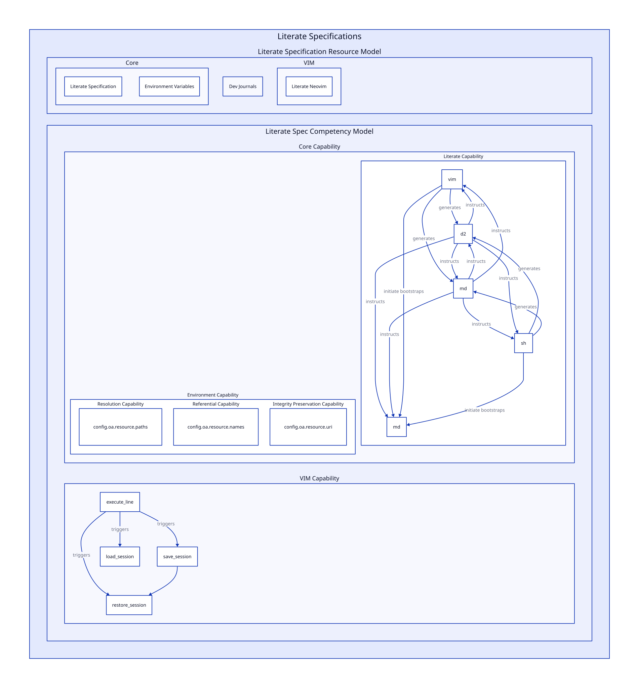

# `OA-SPEC-000` *Literate Specification* 

## Scope

The scope of the `SPEC-000 Literate Specification` document covers:

- The *purpose* of a literate specification.

- The *definition* of a literate specification.

- The *components* of a literate specification.

- The *composition* of a literate specification.

- The *requirements* of a literate specification.

### Definitions

Dynamic capability is capability to compose resources to achieve different capabilities.

Emergent capability are generated by the generative effect interplay between capabilities. 

For example, add a `save session` and a `load session` (a `co-product` named `SessionAction`), the `co-product` provides a `restore session` dynamic capability. 

Basically by defining colimits of a session (`save session` defines the session, until it is saved again. 

The definition of capability is a reusable morphism/action `co-products`, that can be applied to generate resources, where resources is defined with the `(co)limits`. This makes the session unique up to isomprhism, between the `save session`'s.

The emergent capability is that because the (co)limits (start and end of a session is definable), the `session` becomes a resource in its own regards, and then the resource `session` can be used to model higher order interactions, which allow changes within `session` to be self-contained. This definition of a resource can allows insides stay the same, allowing emergent capabilities, such as an adaptive session capability, as the user learns and changes workflows, the `session` is able to adjust, with roll-back capabilities.

Changes to be returned, this is a dynamic capability. The ability to use this process when the sessions provided are based on the environment, would give this an emergent capability.



[Literate Compotency Diagram](./literate-specification.d2)

## Specification 

---

## Literate Competency


```
A literate specification is thecapability
This allows 
The literate specification is
specification 
## 
```


